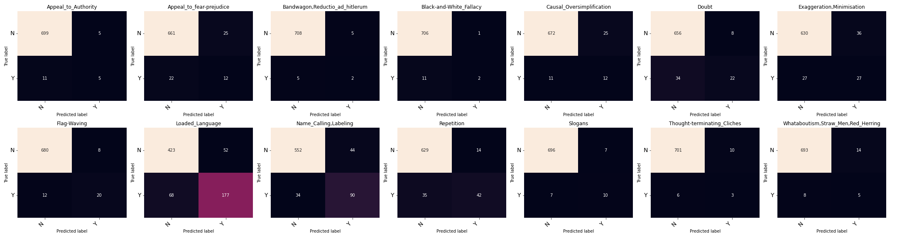

```json
{
    "MODEL_ID": "UBC-NLP/ARBERT",
    "ArabertPreprocessor": false,
    "HIDDEN_SIZE": 768,
    "DEVICE": "cuda",
    "MAX_LEN": 200,
    "TRAIN_BATCH_SIZE": 32,
    "VALID_BATCH_SIZE": 16,
    "TRAIN_VALID_TEST_SPLIT":
    [
        0.8,
        0.1,
        0.1
    ],
    "PATIENCE": 3,
    "EPOCHS": 15,
    "LEARNING_RATE": 0.00007,
    "PATH": "/content/drive/MyDrive/Grad/Grad Proj 2/Arabic_Prop/Transformers/",
    "NUM_LABELS": 14
}
```
Model epoch performance at training-time:


```txt
model name:  UBC-NLP/ARBERT 
Arabert_Prep: False 
Accuracy:  0.6194444444444445

                                    precision    recall  f1-score   support

               Appeal_to_Authority     0.4118    0.4375    0.4242        16
          Appeal_to_fear-prejudice     0.4054    0.4412    0.4225        34
    Bandwagon,Reductio_ad_hitlerum     0.2500    0.1429    0.1818         7
           Black-and-White_Fallacy     0.4000    0.1538    0.2222        13
         Causal_Oversimplification     0.4783    0.4783    0.4783        23
                             Doubt     0.5190    0.7321    0.6074        56
         Exaggeration,Minimisation     0.4912    0.5185    0.5045        54
                       Flag-Waving     0.6923    0.5625    0.6207        32
                   Loaded_Language     0.7625    0.7469    0.7546       245
             Name_Calling,Labeling     0.6975    0.6694    0.6831       124
                        Repetition     0.7719    0.5714    0.6567        77
                           Slogans     0.5500    0.6471    0.5946        17
       Thought-terminating_Cliches     0.1667    0.1111    0.1333         9
Whataboutism,Straw_Men,Red_Herring     0.2500    0.0769    0.1176        13

                         micro avg     0.6427    0.6194    0.6308       720
                         macro avg     0.4890    0.4493    0.4573       720
                      weighted avg     0.6429    0.6194    0.6256       720
                       samples avg     0.6194    0.6194    0.6194       720
```

Confusion Matrices:



