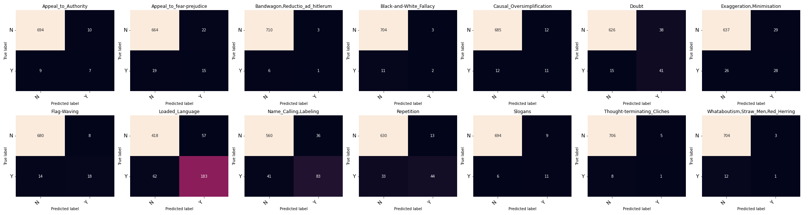

```json
{
    "MODEL_ID": "UBC-NLP/ARBERT",
    "HIDDEN_SIZE": 768,
    "DEVICE": "cuda",
    "MAX_LEN": 200,
    "TRAIN_BATCH_SIZE": 32,
    "VALID_BATCH_SIZE": 16,
    "TRAIN_VALID_TEST_SPLIT":
    [
        0.8,
        0.1,
        0.1
    ],
    "EPOCHS": 15,
    "LEARNING_RATE": 0.00004,
    "MODEL_PATH": "/content/drive/MyDrive/Grad/Grad Proj 2/Arabic_Prop/model.bin",
    "NUM_LABELS": 14,
    "ArabertPreprocessor": false
}
```
Model epoch performance at training-time:


```txt
model name:  UBC-NLP/ARBERT 
Arabert_Prep: False 
Accuracy:  0.5958333333333333

                                    precision    recall  f1-score   support

               Appeal_to_Authority     0.5000    0.3125    0.3846        16
          Appeal_to_fear-prejudice     0.3243    0.3529    0.3380        34
    Bandwagon,Reductio_ad_hitlerum     0.2857    0.2857    0.2857         7
           Black-and-White_Fallacy     0.6667    0.1538    0.2500        13
         Causal_Oversimplification     0.3243    0.5217    0.4000        23
                             Doubt     0.7333    0.3929    0.5116        56
         Exaggeration,Minimisation     0.4286    0.5000    0.4615        54
                       Flag-Waving     0.7143    0.6250    0.6667        32
                   Loaded_Language     0.7729    0.7224    0.7468       245
             Name_Calling,Labeling     0.6716    0.7258    0.6977       124
                        Repetition     0.7500    0.5455    0.6316        77
                           Slogans     0.5882    0.5882    0.5882        17
       Thought-terminating_Cliches     0.2308    0.3333    0.2727         9
Whataboutism,Straw_Men,Red_Herring     0.2632    0.3846    0.3125        13

                         micro avg     0.6281    0.5958    0.6115       720
                         macro avg     0.5181    0.4603    0.4677       720
                      weighted avg     0.6529    0.5958    0.6134       720
                       samples avg     0.5958    0.5958    0.5958       720
```

Confusion Matrices:



