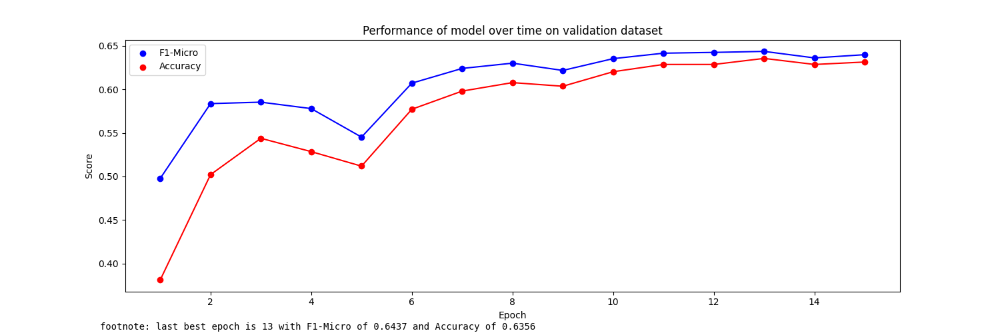

```json
{
    "MODEL_ID": "aubmindlab/bert-base-arabertv02",
    "ArabertPreprocessor": true,
    "HIDDEN_SIZE": 768,
    "DEVICE": "cuda",
    "MAX_LEN": 200,
    "TRAIN_BATCH_SIZE": 32,
    "VALID_BATCH_SIZE": 16,
    "TRAIN_VALID_TEST_SPLIT":
    [
        0.8,
        0.1,
        0.1
    ],
    "PATIENCE": 3,
    "EPOCHS": 15,
    "LEARNING_RATE": 0.00004,
    "PATH": "/content/drive/MyDrive/Grad/Grad Proj 2/Arabic_Prop/Transformers/",
    "NUM_LABELS": 14
}
```
Model epoch performance at training-time:


```txt
model name:  aubmindlab/bert-base-arabertv02 
Arabert_Prep: True 
Accuracy:  0.6305555555555555

                                    precision    recall  f1-score   support

               Appeal_to_Authority     0.3529    0.3750    0.3636        16
          Appeal_to_fear-prejudice     0.4194    0.3824    0.4000        34
    Bandwagon,Reductio_ad_hitlerum     0.5000    0.2857    0.3636         7
           Black-and-White_Fallacy     0.2857    0.3077    0.2963        13
         Causal_Oversimplification     0.4348    0.4348    0.4348        23
                             Doubt     0.7143    0.5357    0.6122        56
         Exaggeration,Minimisation     0.5094    0.5000    0.5047        54
                       Flag-Waving     0.7600    0.5938    0.6667        32
                   Loaded_Language     0.7791    0.7918    0.7854       245
             Name_Calling,Labeling     0.7073    0.7016    0.7045       124
                        Repetition     0.6479    0.5974    0.6216        77
                           Slogans     0.6429    0.5294    0.5806        17
       Thought-terminating_Cliches     0.3000    0.3333    0.3158         9
Whataboutism,Straw_Men,Red_Herring     0.4444    0.3077    0.3636        13

                         micro avg     0.6628    0.6306    0.6463       720
                         macro avg     0.5356    0.4769    0.5010       720
                      weighted avg     0.6623    0.6306    0.6441       720
                       samples avg     0.6306    0.6306    0.6306       720
```

Confusion Matrices:


