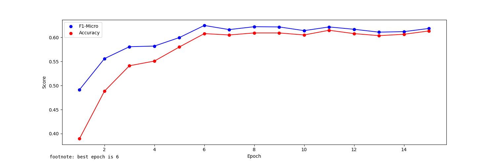
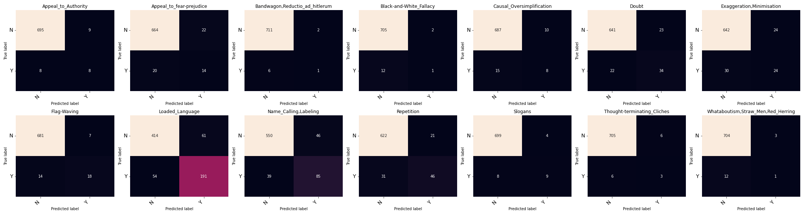

```json
{
    "MODEL_ID": "asafaya/bert-base-arabic",
    "HIDDEN_SIZE": 768,
    "DEVICE": "cuda",
    "MAX_LEN": 200,
    "TRAIN_BATCH_SIZE": 32,
    "VALID_BATCH_SIZE": 16,
    "TRAIN_VALID_TEST_SPLIT":
    [
        0.8,
        0.1,
        0.1
    ],
    "EPOCHS": 15,
    "LEARNING_RATE": 0.00006,
    "MODEL_PATH": "/content/drive/MyDrive/Grad/Grad Proj 2/Arabic_Prop/model.bin",
    "NUM_LABELS": 14,
    "ArabertPreprocessor": false
}
```
Model epoch performance at training-time:


```txt
model name:  asafaya/bert-base-arabic 
Arabert_Prep: False
Accuracy:  0.6

                                    precision    recall  f1-score   support

               Appeal_to_Authority     0.5714    0.2500    0.3478        16
          Appeal_to_fear-prejudice     0.4359    0.5000    0.4658        34
    Bandwagon,Reductio_ad_hitlerum     0.6000    0.4286    0.5000         7
           Black-and-White_Fallacy     0.2500    0.2308    0.2400        13
         Causal_Oversimplification     0.2857    0.2609    0.2727        23
                             Doubt     0.5238    0.3929    0.4490        56
         Exaggeration,Minimisation     0.4808    0.4630    0.4717        54
                       Flag-Waving     0.6522    0.4688    0.5455        32
                   Loaded_Language     0.7361    0.8082    0.7704       245
             Name_Calling,Labeling     0.6897    0.6452    0.6667       124
                        Repetition     0.6875    0.5714    0.6241        77
                           Slogans     0.5263    0.5882    0.5556        17
       Thought-terminating_Cliches     0.2000    0.3333    0.2500         9
Whataboutism,Straw_Men,Red_Herring     0.1429    0.1538    0.1481        13

                         micro avg     0.6189    0.6000    0.6093       720
                         macro avg     0.4844    0.4354    0.4505       720
                      weighted avg     0.6188    0.6000    0.6048       720
                       samples avg     0.6000    0.6000    0.6000       720
```

Confusion Matrices:



