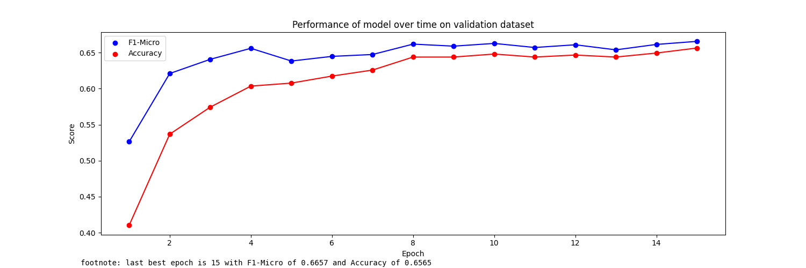

The following experiment investigates the performance of bert-base-cased on the original English version of the dataset and AraBERT-base (the best performing individual transformer) on the Arabic version of the dataset.
Both transformers were trained with the same partiitions of the dataset. The translation process was performed after the original dataset was partioned into train, validaition & test. For example, an English text sample **_x_** with index  **_i_** in the training dataset, had it's corresponding Arabic text **_y_** in the training dataset with index **_i_**.

English Bert-base-cased Confusion Matrix:
