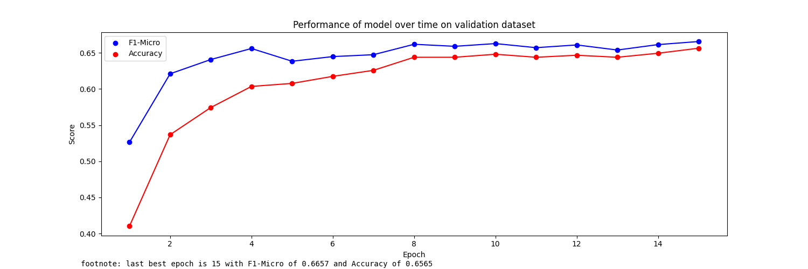

```json
config = {
    "MODEL_ID": "bert-base-cased",
    "HIDDEN_SIZE": 768,
    "DEVICE": "cuda",
    "MAX_LEN": 200,

    "TRAIN_BATCH_SIZE": 32,
    "VALID_BATCH_SIZE": 16,
    "TRAIN_VALID_TEST_SPLIT":[0.8, 0.1, 0.1],// # train-valid-test: 0.8-0.1-0.1

    "PATIENCE":3, //for tuning.

    "EPOCHS": 15,
    "LEARNING_RATE": 1e-5,

    "PATH": "/content/drive/MyDrive/Grad/Grad Proj 2/Arabic_Prop/Transformers/",
    "NUM_LABELS": 14,
  }
```
Model epoch performance at training-time:


```txt
model name:  bert-base-cased 
Accuracy:  0.2722222222222222

                                    precision    recall  f1-score   support

               Appeal_to_Authority     0.0000    0.0000    0.0000        16
          Appeal_to_fear-prejudice     0.0000    0.0000    0.0000        34
    Bandwagon,Reductio_ad_hitlerum     0.0000    0.0000    0.0000         7
           Black-and-White_Fallacy     0.0000    0.0000    0.0000        13
         Causal_Oversimplification     0.0000    0.0000    0.0000        23
                             Doubt     0.0000    0.0000    0.0000        56
         Exaggeration,Minimisation     0.0000    0.0000    0.0000        54
                       Flag-Waving     0.0000    0.0000    0.0000        32
                   Loaded_Language     0.4024    0.6816    0.5061       245
             Name_Calling,Labeling     0.3059    0.2097    0.2488       124
                        Repetition     0.1250    0.0260    0.0430        77
                           Slogans     1.0000    0.0588    0.1111        17
       Thought-terminating_Cliches     0.0000    0.0000    0.0000         9
Whataboutism,Straw_Men,Red_Herring     0.0000    0.0000    0.0000        13

                         micro avg     0.3784    0.2722    0.3166       720
                         macro avg     0.1309    0.0697    0.0649       720
                      weighted avg     0.2266    0.2722    0.2223       720
                       samples avg     0.2722    0.2722    0.2722       720
```

Confusion Matrix:


