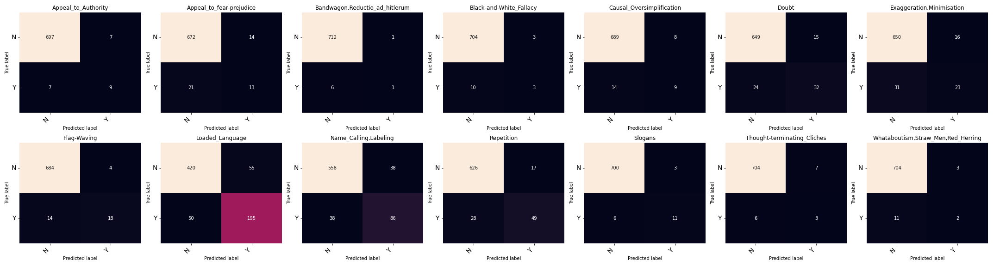

```txt
Using models:

asafaya/bert-base-arabic
UBC-NLP/ARBERT
aubmindlab/bert-base-arabertv02

                                    precision    recall  f1-score   support

               Appeal_to_Authority     0.5625    0.5625    0.5625        16
          Appeal_to_fear-prejudice     0.4815    0.3824    0.4262        34
    Bandwagon,Reductio_ad_hitlerum     0.5000    0.1429    0.2222         7
           Black-and-White_Fallacy     0.5000    0.2308    0.3158        13
         Causal_Oversimplification     0.5294    0.3913    0.4500        23
                             Doubt     0.6809    0.5714    0.6214        56
         Exaggeration,Minimisation     0.5897    0.4259    0.4946        54
                       Flag-Waving     0.8182    0.5625    0.6667        32
                   Loaded_Language     0.7800    0.7959    0.7879       245
             Name_Calling,Labeling     0.6935    0.6935    0.6935       124
                        Repetition     0.7424    0.6364    0.6853        77
                           Slogans     0.7857    0.6471    0.7097        17
       Thought-terminating_Cliches     0.3000    0.3333    0.3158         9
Whataboutism,Straw_Men,Red_Herring     0.4000    0.1538    0.2222        13

                         micro avg     0.7039    0.6306    0.6652       720
                         macro avg     0.5974    0.4664    0.5124       720
                      weighted avg     0.6934    0.6306    0.6555       720
                       samples avg     0.6306    0.6306    0.6306       720
```

Confusion Matrices:



