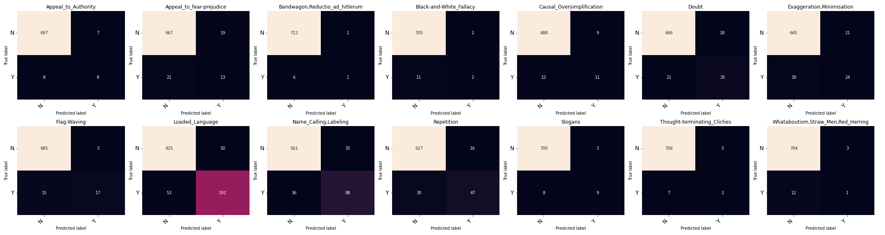

```txt
Using models:

asafaya/bert-base-arabic
UBC-NLP/ARBERT
aubmindlab/bert-base-arabertv02

                                    precision    recall  f1-score   support

               Appeal_to_Authority     0.5333    0.5000    0.5161        16
          Appeal_to_fear-prejudice     0.4062    0.3824    0.3939        34
    Bandwagon,Reductio_ad_hitlerum     0.5000    0.1429    0.2222         7
           Black-and-White_Fallacy     0.5000    0.1538    0.2353        13
         Causal_Oversimplification     0.5500    0.4783    0.5116        23
                             Doubt     0.6604    0.6250    0.6422        56
         Exaggeration,Minimisation     0.5333    0.4444    0.4848        54
                       Flag-Waving     0.8500    0.5312    0.6538        32
                   Loaded_Language     0.7934    0.7837    0.7885       245
             Name_Calling,Labeling     0.7154    0.7097    0.7126       124
                        Repetition     0.7460    0.6104    0.6714        77
                           Slogans     0.7500    0.5294    0.6207        17
       Thought-terminating_Cliches     0.2857    0.2222    0.2500         9
Whataboutism,Straw_Men,Red_Herring     0.2500    0.0769    0.1176        13

                         micro avg     0.7009    0.6250    0.6608       720
                         macro avg     0.5767    0.4422    0.4872       720
                      weighted avg     0.6904    0.6250    0.6509       720
                       samples avg     0.6250    0.6250    0.6250       720
```

Confusion Matrices:



