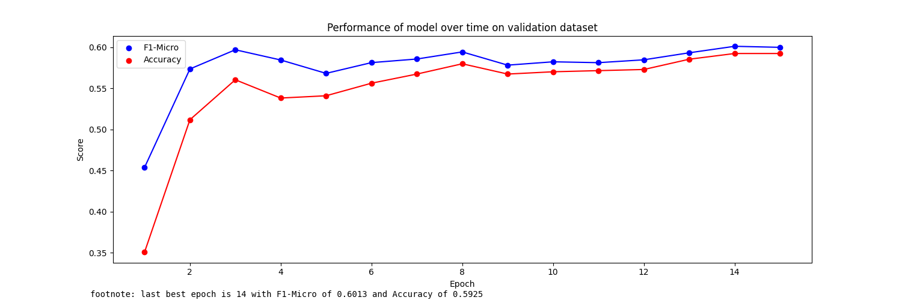
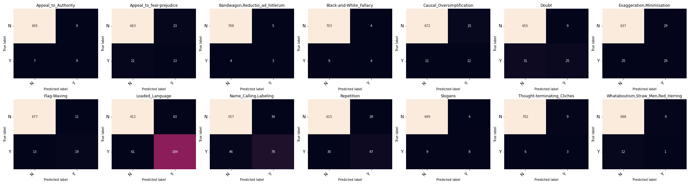

```json
{
    "MODEL_ID": "UBC-NLP/MARBERT",
    "HIDDEN_SIZE": 768,
    "DEVICE": "cuda",
    "MAX_LEN": 200,
    "TRAIN_BATCH_SIZE": 32,
    "VALID_BATCH_SIZE": 16,
    "EPOCHS": 15,
    "LEARNING_RATE": 0.00008,
    "NUM_LABELS": 14,
    "ArabertPreprocessor": false
}
```
Model epoch performance at training-time:


```txt
Accuracy:  0.5388888888888889

                                    precision    recall  f1-score   support

               Appeal_to_Authority     0.0000    0.0000    0.0000        16
          Appeal_to_fear-prejudice     0.3667    0.3235    0.3438        34
    Bandwagon,Reductio_ad_hitlerum     0.0000    0.0000    0.0000         7
           Black-and-White_Fallacy     0.2500    0.1538    0.1905        13
         Causal_Oversimplification     0.2667    0.3478    0.3019        23
                             Doubt     0.4773    0.3750    0.4200        56
         Exaggeration,Minimisation     0.4510    0.4259    0.4381        54
                       Flag-Waving     0.6111    0.3438    0.4400        32
                   Loaded_Language     0.7061    0.7551    0.7298       245
             Name_Calling,Labeling     0.6094    0.6290    0.6190       124
                        Repetition     0.6615    0.5584    0.6056        77
                           Slogans     0.4286    0.3529    0.3871        17
       Thought-terminating_Cliches     0.0000    0.0000    0.0000         9
Whataboutism,Straw_Men,Red_Herring     0.0000    0.0000    0.0000        13

                         micro avg     0.5757    0.5389    0.5567       720
                         macro avg     0.3449    0.3047    0.3197       720
                      weighted avg     0.5545    0.5389    0.5432       720
                       samples avg     0.5389    0.5389    0.5389       720

```

Confusion Matrices:



