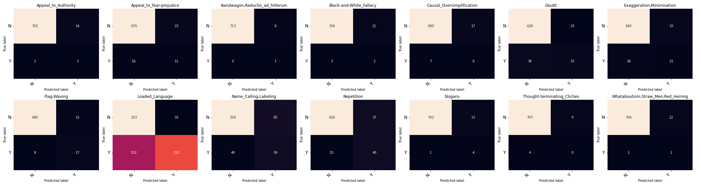

This is a model based on the Support vector machine algorithm. It was trained on Tf.Idf features obtained from the training dataset.

```txt
SVM Accuracy Score:  0.5680555555555555
SVM F1-Micro Score:  0.5680555555555555
Training efficiency: 4.72
model: SVM with Tf.Idf features.

                                    precision    recall  f1-score   support

               Appeal_to_Authority     0.1250    0.5000    0.2000         4
          Appeal_to_fear-prejudice     0.3235    0.4074    0.3607        27
    Bandwagon,Reductio_ad_hitlerum     0.1429    1.0000    0.2500         1
           Black-and-White_Fallacy     0.1538    0.4000    0.2222         5
         Causal_Oversimplification     0.2609    0.4615    0.3333        13
                             Doubt     0.5893    0.4783    0.5280        69
         Exaggeration,Minimisation     0.3889    0.4468    0.4158        47
                       Flag-Waving     0.5312    0.6800    0.5965        25
                   Loaded_Language     0.8653    0.5824    0.6962       364
             Name_Calling,Labeling     0.4758    0.5960    0.5291        99
                        Repetition     0.5195    0.7273    0.6061        55
                           Slogans     0.2353    0.8000    0.3636         5
       Thought-terminating_Cliches     0.0000    0.0000    0.0000         4
Whataboutism,Straw_Men,Red_Herring     0.0769    0.5000    0.1333         2

                          accuracy                         0.5681       720
                         macro avg     0.3349    0.5414    0.3739       720
                      weighted avg     0.6635    0.5681    0.5949       720
```

Confusion Matrices:



